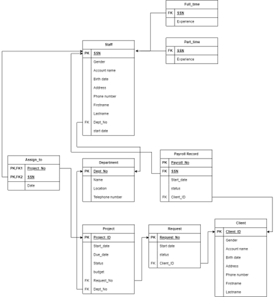

# Database Principles Project - Advertising Business Submission System

## Project Overview
This project presents the **relational database design** for an **Advertising Business Submission System**, allowing clients to submit their advertising demands and agencies to manage and track these requests.

The database system was designed by me using:
- **Entity-Relationship (ER) Diagram**
- **Relational Schema**
- **Normalization (BCNF)**
- **Simple SQL Queries for Data Retrieval, Joins, Aggregation, and Updates**

## Project Files

**documents**
- [documents/s4780187_project part1.pdf](documents/s4780187_project%20part1.pdf)
- [documents/s4780187_project part2.pdf](documents/s4780187_project%20part2.pdf)

**diagrams**
- [diagrams/ERD_final edition.drawio.png](diagrams/ERD_final%20edition.drawio.png)
- [diagrams/normalization.png](diagrams/normalization.png)
- [diagrams/relationship schema-Page-2.drawio.png](diagrams/relationship%20schema-Page-2.drawio.png)

**query results**
- [query results/aggregate.png](query%20results/aggregate.png)
- [query results/join1.png](query%20results/join1.png)
- [query results/join2.png](query%20results/join2.png)
- [query results/update(before).png](query%20results/update(before).png)
- [query results/update.png](query%20results/update.png)

### Important Note  
The SQL server used for this project was hosted on a university-managed system, which was shut down after the course ended. As a result, the original SQL code is no longer available. However, the project documentation, ER diagrams, relational schema, and query results have been preserved in this repository.

## Database Design

### Entity Relationship Diagram
The Entity Relationship Diagram illustrates the structure of the advertising business database, including the relationships between clients, requests, projects, and staff.  

### Relational Schema
The Relational Schema provides a detailed view of table structures, primary keys, and foreign key relationships.  

### Normalization
The normalization process ensured that the database design adheres to BCNF principles.  

## SQL Queries Demonstrated

### Join Query
Retrieves all requests corresponding to each client.  
Results:

### Update Query
Updates the status of a project to reflect its completion.  
Results:
.png)
  

### Aggregation Query
Calculates the total payroll for each staff.  
Results:

## Normalization and BCNF Compliance
The database schema was normalized and checked for BCNF.
- Functional dependencies were identified for each relation.
- Each relation was analyzed to ensure that every functional dependency had a superkey.
- I confirmed that no relations violated BCNF.

## Technologies Used
- SQL and Relational Database Design
- XAMPP and phpMyAdmin control

## Future Improvements
- Implement a user interface for better usability
- Secure user data with hash functions
- Expand with stored procedures and triggers
