# Database Principles Project - Advertising Business Submission System

## Project Overview
This project presents the **relational database design** for an **Advertising Business Submission System**, allowing clients to submit their advertising demands and agencies to manage and track these requests. The system was originally implemented using MySQL, with schema planning, normalization, and query testing performed via phpMyAdmin and XAMPP. 

Note: The original implementation was hosted on a university-managed server, which is no longer accessible. A recreation of this project with a working database backend and web-based UI is currently in progress in the other repo.

## File Structure
```
.
│   README.md
│
├───diagrams
│       erd_final_edition.png
│       er_to_relational_mapping.png
│       formal_relational_schema.png
│       functional_dependencies.png
│       graphical_relational_schema.png
│
└───query
    ├───aggregate
    │       aggr_payroll_record.png
    │       aggr_project_deadline.png
    │       aggr_result.png
    │       aggr_result_group_by.png
    │       sql_aggr_group_by.png
    │       sql_aggr_sum.png
    │
    ├───division
    │       division_payroll_record.png
    │       division_result.png
    │       division_staff.png
    │       sql_division.png
    │
    ├───join
    │       join_client.png
    │       join_request.png
    │       join_result.png
    │       sql_join.png
    │
    └───update
            project_after_update.png
            project_before_update.png
            sql_update.png
```

## Functional Overview

**Client-Side:**

Clients can register and submit advertising requests.

View status updates on their submissions.

**Staff-Side:**

Staff can log in with SSN, view requests, and create or update project status.

Payroll and department details are associated.

Software used in initial version: XAMPP + phpMyAdminLanguage used: SQL, and originally Python (planning stage)


In the new version, I plan to recreate the system using PostgreSQL + Docker, to explore modern deployment and database tools and step away from XAMPP/phpMyAdmin, which I’ve already worked with.


## Database Design

### Entity Relationship Diagram (ERD)

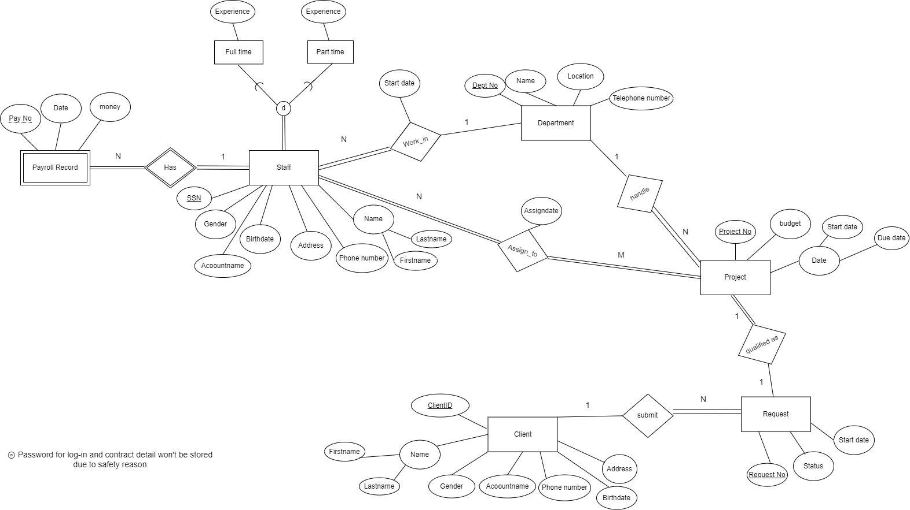

### Relational Schema (Graphical + Text-Based)

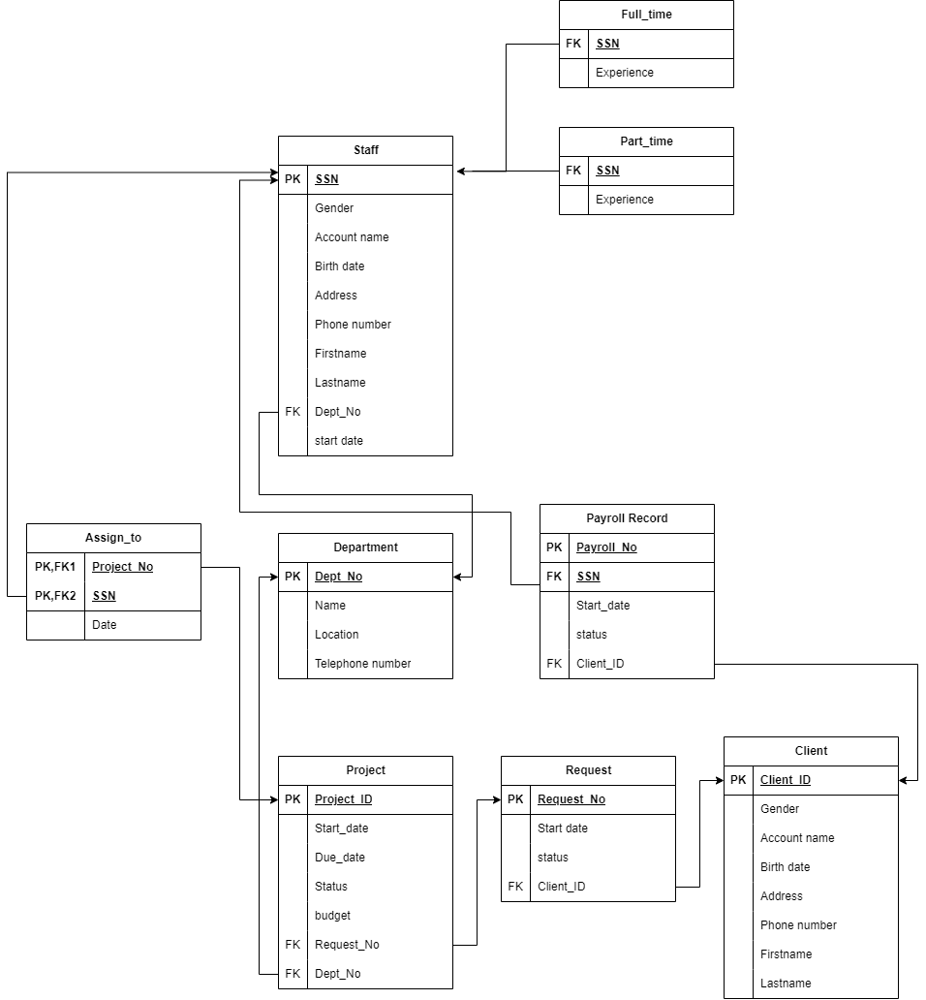

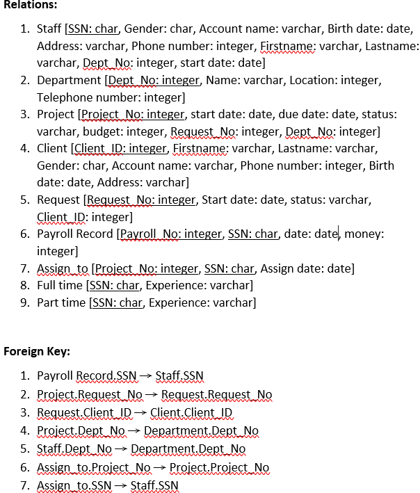

### Functional Dependencies

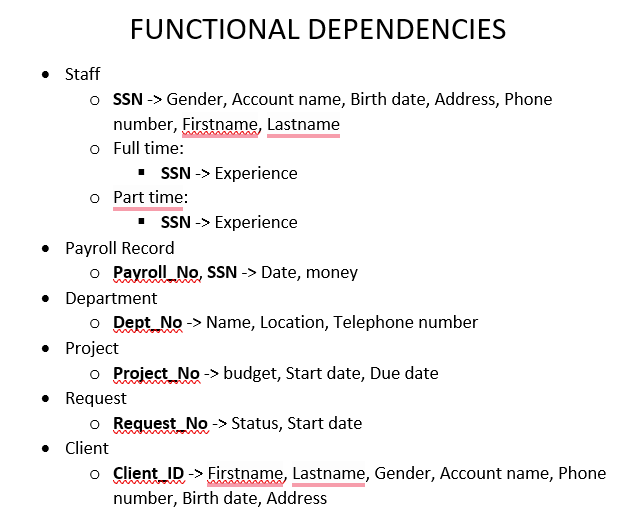

### Relationship Cardinality & Mapping Reference

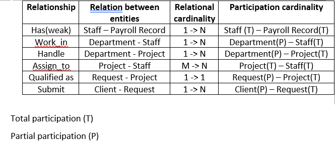


## Query Demonstration

### Join Query   
Retrieves all requests corresponding to each client.

**Dataset Used:**

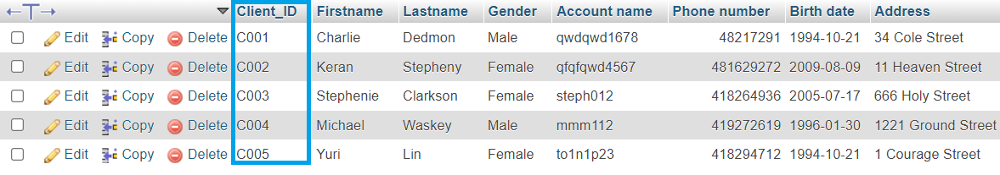  

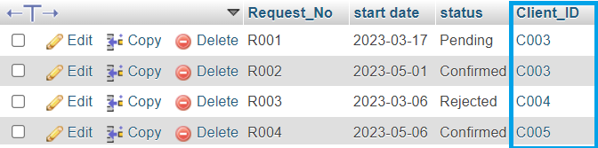

**SQL query:**

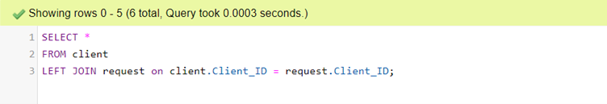

**Result:**

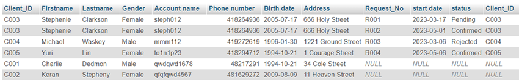

### Update Query
Updates the status of a project to reflect its completion.  

**Dataset Used:**

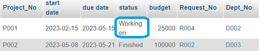

**SQL query:**

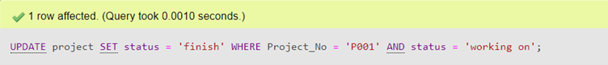

**Result:**

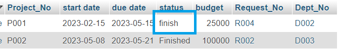

### Aggregation Query
Calculates the total payroll for each staff or check the days before deadline.  

**Dataset used:**

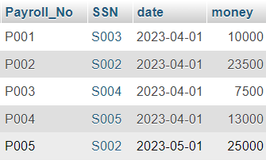

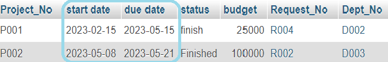

**SQL query:**

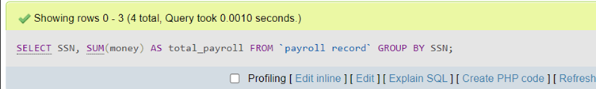

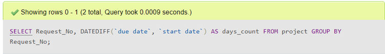

**Results:**

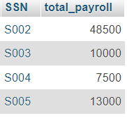

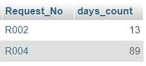

## Technologies Used
- SQL: Query and data operations

- phpMyAdmin: Admin panel to manage MySQL DB

- XAMPP: Local development server for DB setup

### Planned Technology Stack (for recreation):

- Database: PostgreSQL (containerized with Docker)

- Admin Panel: pgAdmin or DBeaver

- Frontend: Flask or Django (Python)

- Dev Environment: Docker Compose

Legacy SQL Queries: The original queries were developed for MySQL and will be refactored for PostgreSQL during the rebuild.


## Future Improvements
- Implement a user interface for better usability
- Secure user data with hash functions
- Expand with stored procedures and triggers\
These will be implemented in the recreated system!!!
